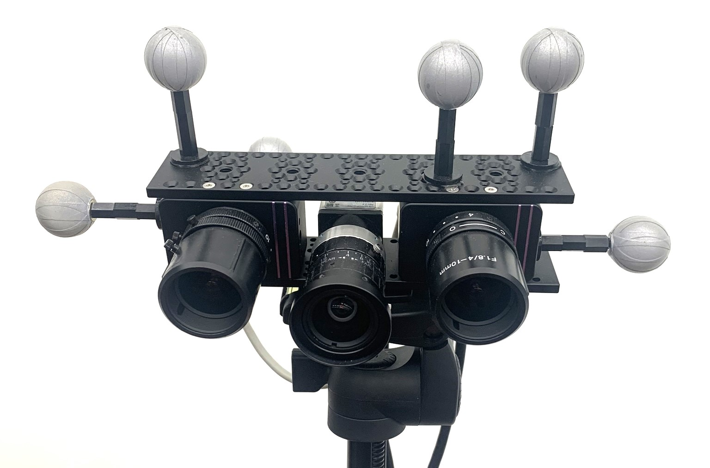

# MTevent: A Multi-Task Event Camera Dataset for 6D Pose Estimation and Moving Object Detection [[arXiv](https://arxiv.org/abs/2505.11282)] [[CVF](https://openaccess.thecvf.com/content/CVPR2025W/EventVision/html/Awasthi_MTevent_A_Multi-Task_Event_Camera_Dataset_for_6D_Pose_Estimation_CVPRW_2025_paper.html)]  

Contains scrips to process and analyse the MTevent dataset.

The MTevent dataset is designed to advance event-based perception in dynamic environments. It addresses key challenges such as occlusions, varying lighting, extreme viewing angles, and long detection distances, providing a comprehensive benchmark for event-based vision across multiple tasks—including 6D pose estimation of static and moving rigid objects, 2D motion segmentation, 3D bounding box detection, optical flow estimation, and object tracking. Annotations included in the dataset:  
1. 6D pose of rigid objects.
2. 3D/2D bouding box coordinates of all moving objects.  
We used a stereo setup of event cameras and one RGb camera to record and annotate videos. Below figure shows 2 dvxplorers on either side of the RGB camera.  

<p align="center">
  
  
  
</p>

The dataset includes:  
Rigid objects- Objects with ids from MR6D1 to MR6D16  
Non-rigid objects - Human and forklift  
The **mesh models** for rigid objects are stored at location annotation/obj_model
  
The link to download the dataset: [MTevent](https://huggingface.co/datasets/anas-gouda/MTevent/tree/main)  
Download all the scenes to a folder which would be the root folder.


## Data pre-processing
1. Execute script Data_pre_processing/extract_rgb_events_vicon_data_from_bag.py.  
   This script extracts rgb images, vicon data for moving rigid objects, human_head and forklift handle. The json files are saved in the folder root/scene /vicon_data/. The rgb images in .jpg format are saved in the folder root/scene /rgb.

2. Execute **bag_to_event_img.py**
   Extracts the events from left and right event camera bag files as slices. Each slice is accumulated and saved as a jpg image for visualisation purpose. The event visualisation are saved in root/scene /event_images/left and root/scene /event_images/right

3. Execute **extract_human_from_bag.py**
   Extract non rigid objects human and forklift. Markers are plpaced on hand, feet, head and waist for human. This script considers all markers to compute 3D bbox values for human. Similarly it considers al the markers placed on forklift to compute 3D bbox.

## Annotations
### Non Rigid Objects

Execute Annotations/human_annotation_bbox_pose.py.  
   This scripts annotates the non rigid objects (human and forklift) with 3D BBoxes and saves the visualsations and json files in the folder annotation_human. The mesh models for objects are stored at location annotation/obj_model. This path should be changed in the script    
   NOTE: Sometimes the annotations are incorrect for a few frames. This is due to incorrect reading from Vicon. In that case we need to smoothen the BBox for the human and forklift.  
   To **Smoothen**:  
   First execute mask_to_bbox. py and then execute filter_bbox.py
   The smoothened 3D bbox and pose values will be saved in folder smoothened.
<p align="center">
  
  
</p>

### Masks
Execute segment_anything.py to extract masks for human and forklift from RGB images. The segmented RGB images are stored in folder output_masks_human_img. Executing annotation_bbox_pose.py will also give you the maks for the objects. The object masks are stored in folder masks_rgb_MR6D.
<p align="center">
  
  
</p>

### Rigid Objects
Execute annotation_bbox_pose.py.  
The 2D, 3D BBox and 6D Pose values for all rigid objects and for all three cameras are stored in the annotation folder. The masks for objects are stored in npy file format.
<p align="center">
  
</p>

## 📚 Citation

If you use this dataset, please cite:

```bibtex
@inproceedings{awasthi2025mtevent,
  title={MTevent: A Multi-Task Event Camera Dataset for 6D Pose Estimation and Moving Object Detection},
  author={Awasthi, Shrutarv and Gouda, Anas and Franke, Sven and Rutinowski, J{\'e}r{\^o}me and Hoffmann, Frank and Roidl, Moritz},
  booktitle={Proceedings of the Computer Vision and Pattern Recognition Conference},
  pages={5063--5071},
  year={2025}
}

    


